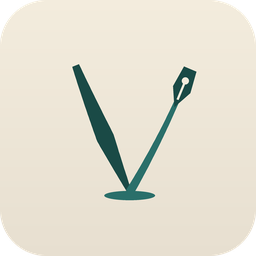
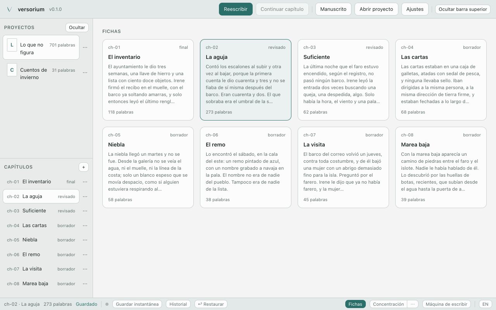
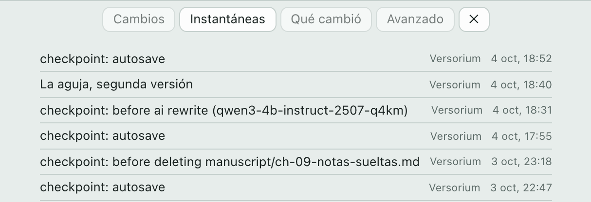
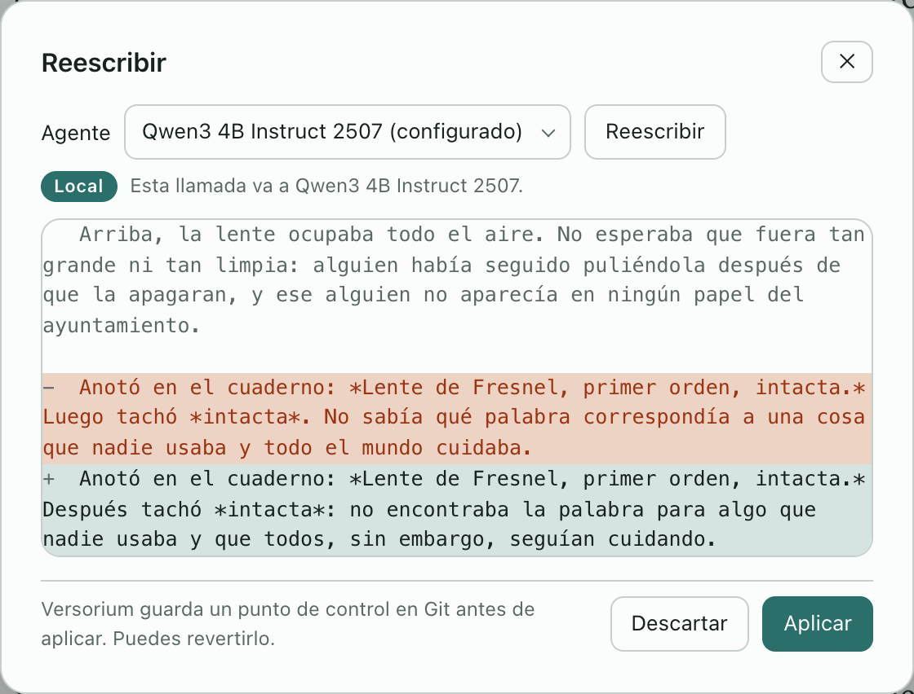

<p align="center">
  <a href="https://versorium.maecly.com/"></a>
</p>

<h1 align="center">Escribe tu novela.<br>Cada borrador queda <em>guardado</em>.</h1>

<p align="center">
  <b>Versorium</b> es una app para escribir novelas en tu ordenador. Funciona sin conexión.<br>
  La IA está apagada hasta que la llames.
</p>

<p align="center">
  <b>Gratis</b> · <b>Sin cuenta</b> · <b>Código abierto</b>
</p>

<p align="center">
  <a href="https://versorium.maecly.com/#descargar"></a>
</p>

<p align="center">
  <a href="https://versorium.maecly.com/#descargar"><sub>v0.1.1 · probada en Mac con Apple silicon, Windows 11 y Ubuntu 22.04 (v0.1.0) · aún sin probar en Mac Intel</sub></a>
</p>

<p align="center">
  <a href="https://github.com/MAECLY/versorium-app/releases/latest"></a>
  <a href="LICENSE"></a>
  <a href="#ya-puedes-descargarla"></a>
  <a href="README.md"></a>
  <a href="https://versorium.maecly.com/detalles/#privacidad"></a>
</p>

<p align="center">
  <a href="https://versorium.maecly.com/"><b>Web</b></a> ·
  <a href="#ya-puedes-descargarla">Descargar</a> ·
  <a href="https://versorium.maecly.com/detalles/">Límites y detalles</a> ·
  <a href="CONTRIBUTING.md">Contribuir</a> ·
  <a href="README.md">English</a>
</p>

<p align="center">
  <a href="https://versorium.maecly.com/">
    <picture>
      <source media="(prefers-color-scheme: dark)" srcset=".github/readme/es/corkboard-dark.webp">
      
    </picture>
  </a>
</p>

> [!NOTE]
> **Está empezando, y lo decimos claro.** Versorium se ha probado en un Mac con Apple silicon, en Windows 11 y en Ubuntu 22.04 con el `.deb` de la v0.1.0. Los Mac Intel, el `.rpm` y el AppImage no se han abierto. Si abres uno, una [incidencia](https://github.com/MAECLY/versorium-app/issues) contando cómo te fue ayuda mucho.

---

## I. Nada se pierde.

Versorium guarda mientras escribes. Cada minuto si algo cambió, antes de que la
IA escriba nada y antes de borrar un capítulo, hace una instantánea. ¿Borraste
una frase en esta sesión? **↩ Restaurar** la devuelve.

Las instantáneas son commits de Git, hechos con el Git que la app lleva dentro:
no tienes que instalarlo, ni saber usarlo para escribir.

<p align="center">
  <picture>
    <source media="(prefers-color-scheme: dark)" srcset=".github/readme/es/history-dark.webp">
    
  </picture>
</p>

> [!NOTE]
> Volver a una instantánea antigua requiere Git, por ahora. La app todavía no tiene pantalla para eso.

## II. Tuya, de principio a fin.

- **Una carpeta en tu disco.** Cada capítulo es un archivo Markdown que se abre
  sin Versorium.
- **Un registro de quién escribió qué.** Cada inserción y cada borrado quedan
  anotados en la carpeta de la novela con su autor: tú, o la IA que lo hizo.
- **Respaldos de los que fiarte.** Un clic escribe un zip de toda la novela, con
  su historial, en hasta tres carpetas. Cada zip se vuelve a leer y se comprueba
  después de escribirlo, y al restaurar se descomprime junto a tu novela, nunca
  encima.
- **Sin cuenta, sin telemetría.** Por su cuenta, la app solo busca
  actualizaciones, sin nada de tu novela, y puedes desactivarlo.

Si Versorium desaparece mañana, tu novela no.

### La IA, solo si la llamas.

Está apagada hasta que elijas una, y no escribe nada sin tu permiso. Cada
reescritura te enseña el cambio antes, y Versorium hace una instantánea antes de
aplicarlo.

| Nivel | Qué se usa | Adónde va tu pasaje |
|---|---|---|
| **Apagada** | Nada | A ningún sitio |
| **En tu ordenador** | Un modelo dentro de la propia app (llama.cpp integrado; 11 modelos de escritura para elegir, que solo se descargan si lo pides), Ollama o un servidor local como LM Studio. | Se queda en tu ordenador. Un servidor local que apunte a otra máquina se marca como Red. |
| **Tu herramienta** | El Claude Code, Codex u OpenCode que ya tienes instalado y con tu sesión. Solo Reescribir. | Al servicio de esa herramienta |

Hoy la IA reescribe pasajes y, con un modelo en tu ordenador, revisa la
continuidad. Versorium también es un
[servidor MCP](#para-desarrolladores), así que los asistentes que ya usas pueden
leer tu manuscrito. Es de solo lectura salvo que permitas más.

<p align="center">
  <picture>
    <source media="(prefers-color-scheme: dark)" srcset=".github/readme/es/rewrite-dark.webp">
    
  </picture>
</p>

**Actualizaciones.** La app las busca una vez al abrirse, sin cuenta y sin nada
de tu novela; se desactiva en Ajustes → Aplicación. Solo instala una
actualización si su firma minisign coincide con la clave que lleva dentro y su
SHA-256 coincide con el `SHA256SUMS` de la versión. Ya se ha hecho una
actualización completa, de la 0.1.0 a la 0.1.1, en macOS (Apple silicon) y en
Windows 11.

## III. Una mesa para escribir.

Fichas · Concentración · Reescribir · Máquina de escribir · Corrector ortográfico ·
Tamaño y ancho del texto · Plantillas · Respaldo en un clic · Español e inglés

Tres temas, Folio, Quarry y Needle, cada uno claro y oscuro. Las imágenes de
aquí son Needle.

**Formatos.** Exporta a DOCX con formato de manuscrito, EPUB 3, PDF, Markdown y
Scrivener. Importa Markdown, DOCX, EPUB y Scrivener, con una vista previa antes
de crear nada.

## Ya puedes descargarla.

[versorium.maecly.com](https://versorium.maecly.com/#descargar) elige el archivo
para tu ordenador. O tómalo directamente de la última versión:

| Ordenador | Archivo | Probada |
|---|---|---|
| Mac con Apple silicon, macOS 10.15+ | [`.dmg`](https://github.com/MAECLY/versorium-app/releases/latest) | Sí |
| Mac con procesador Intel, macOS 10.15+ | [`.dmg`](https://github.com/MAECLY/versorium-app/releases/latest) | Todavía no |
| Windows, x64 | [instalador `.exe` o `.msi`](https://github.com/MAECLY/versorium-app/releases/latest) | Los dos (v0.1.0), en Windows 11, y después la actualización a la 0.1.1 desde la app |
| Linux, x64 | [`.deb`, `.rpm` o `.AppImage`](https://github.com/MAECLY/versorium-app/releases/latest) | El `.deb` de la v0.1.0, en Ubuntu 22.04. Todavía no el `.rpm` ni el `.AppImage` |

Cada versión incluye un archivo `SHA256SUMS`. Para enterarte de las próximas:
**Watch → Custom → Releases** en esta página, o el
[feed RSS](https://github.com/MAECLY/versorium-app/releases.atom).

> [!WARNING]
> Las versiones todavía no están firmadas con un certificado de Apple ni de
> Microsoft, así que macOS y Windows te avisan la primera vez. Sigue estos pasos
> solo con un archivo que hayas bajado de las versiones de este repositorio.
>
> <details>
> <summary><b>macOS dice que la app está dañada.</b> No lo está.</summary>
>
> macOS pone en cuarentena las apps sin Apple Developer ID. Mueve Versorium a
> Aplicaciones y quita la marca una vez, en Terminal:
>
> ```bash
> xattr -rd com.apple.quarantine /Applications/Versorium.app
> ```
>
> Esa marca es la comprobación que te protege de una descarga manipulada.
>
> </details>
>
> <details>
> <summary><b>Windows muestra «Windows protegió su PC».</b></summary>
>
> Elige **Más información** y luego **Ejecutar de todas formas**. Versorium
> necesita un procesador x86-64-v2 (SSE4.2) y Vulkan (`vulkan-1.dll`, que se
> instala normalmente con los controladores gráficos); en un PC sin
> controladores Vulkan no se ha probado. Si la v0.1.0 no arrancaba porque
> faltaba `MSVCP140.dll`, la v0.1.1 lo arregla.
>
> </details>
>
> <details>
> <summary><b>Linux</b></summary>
>
> Marca el AppImage como ejecutable (`chmod +x`) si tu gestor de archivos no lo
> ha hecho. El `.deb` depende de `libvulkan1` y `libssl3`. Versorium necesita un
> procesador x86-64-v2 (SSE4.2).
>
> </details>

## Lo que todavía no hace.

- La IA solo reescribe pasajes y revisa la continuidad. La continuidad lee los
  títulos de los capítulos, los encabezados de escena y el códice, no la prosa,
  y solo funciona con un modelo en tu ordenador. No hay chat, y «Continuar
  capítulo» está, pero desactivado.
- El corrector usa el del sistema: funciona en macOS y en Windows, y en Linux
  todavía no subraya nada.
- Aún sin abrir: los Mac Intel, el `.rpm`, el AppImage y la v0.1.1 en Linux.
- Volver a una instantánea requiere Git.
- Los respaldos se hacen a mano.
- Las versiones no están firmadas (mira arriba).
- Al importar de Word, EPUB o Scrivener se pierden negritas, cursivas y escenas.

Todos los límites conocidos, con lo que se probó y lo que no, están en la
[página de detalles](https://versorium.maecly.com/detalles/#limites).

## Por qué existe.

> Hice Versorium para mí. Quería escribir con calma, sin miedo a perder lo escrito, y usar la IA a mi manera o no usarla. Las apps que probé se quedaban cortas para una novela o cobraban de más. Por eso es gratis y de código abierto: tu novela vive en una carpeta tuya, cada cambio queda guardado y la IA (la que ya pagas, una en tu ordenador o ninguna) solo entra cuando la llamas. Y la sigo mejorando.
>
> — Miguel Angel Esparza Calero, [maecly.com](https://www.maecly.com/about)

<details>
<summary><b>Preguntas</b></summary>

<br>

**¿Mi novela sale de mi ordenador?**
Solo si tú lo pides: al enviarla a GitHub, al reescribir con una herramienta
externa o con un servidor en otra máquina, al dejar que un asistente la lea por
MCP o al respaldarla en una carpeta que se sincroniza. Por su cuenta, la app
solo busca actualizaciones, sin nada de tu novela, y puedes desactivarlo.

**¿Necesito una cuenta o saber Git?**
Cuenta, no: no hay registro. Git, tampoco para escribir: Versorium hace las
instantáneas por ti con el Git que lleva dentro. Por ahora solo hace falta para
volver a una antigua.

**¿Qué IA usa?**
Ninguna hasta que elijas una: un modelo dentro de la propia app, Ollama o un
servidor local, o Claude Code, Codex u OpenCode, que envían el pasaje a su propio
servicio.

**¿Funciona en Windows y Linux?**
Se ha probado en Windows 11, y en Ubuntu 22.04 con el `.deb` de la v0.1.0. En
los dos se instaló, creó una novela y guardó mientras se escribía, y en Windows
una actualización de la 0.1.0 a la 0.1.1 se instaló desde la propia app. El
`.rpm`, el AppImage y la v0.1.1 en Linux todavía no se han abierto.

**¿Puedo traer mi novela de Scrivener o Word?**
Sí: importa Scrivener, DOCX, EPUB y Markdown, y te enseña una vista previa antes
de crear nada. Desde DOCX, EPUB o Scrivener se pierden negritas, cursivas y
escenas.

**¿Por qué es gratis?**
Es código abierto (AGPL-3.0) y lo hace una persona. No hay versión de pago ni
anuncios, y la app no recoge datos.

</details>

## Ayuda a mejorarla.

No hace falta programar para ayudar.

- **Pruébala en un Mac Intel, o el `.rpm` o el AppImage en Linux**, y
  [abre una incidencia](https://github.com/MAECLY/versorium-app/issues) contando
  qué pasó.
- **Informa de un fallo** desde la propia app: el botón **Informar** del registro
  de fallos abre una incidencia ya rellenada en tu navegador, sin texto de tu
  novela.
- **Mejora el español o el inglés** en [`locales/`](locales).
- **Envía un arreglo.** Lee [CONTRIBUTING.md](CONTRIBUTING.md) (en inglés) y
  acepta el [Acuerdo de Licencia de Contribuidor](CLA.md); conservas los
  derechos de autor de lo que escribas. Pasa las comprobaciones de abajo antes de
  abrir el pull request.

Si Versorium te sirve, una estrella ayuda a que otros escritores la encuentren.

---

## Para desarrolladores

Tauri 2 · Rust · Svelte 5 · CodeMirror 6 · libgit2 · llama.cpp

<details>
<summary><b>Compilar desde el código</b></summary>

<br>

Necesitas Rust estable, Node `^20.19` o `>=22.12`, pnpm (fijado en
`package.json`) y cmake con un compilador de C/C++, porque llama.cpp se compila
desde el código. En Linux, además, los paquetes que instala la CI (están en
[`ci.yml`](.github/workflows/ci.yml)).

```bash
pnpm install
make dev PNPM=pnpm             # la app de escritorio, con recarga en caliente
make verify PNPM=pnpm          # todas las comprobaciones: tipos, idiomas, UI, Rust, clippy, end-to-end
pnpm tauri build --no-sign     # instaladores, sin la clave del actualizador del mantenedor
```

El Makefile necesita un shell POSIX y por defecto usa el pnpm de Homebrew en
Apple silicon; de ahí `PNPM=pnpm`. En Windows, ejecuta los scripts directamente:
`pnpm tauri dev`, y luego `pnpm check`, `pnpm locales`, `pnpm test:ui`,
`pnpm test:e2e` y `cargo test` / `cargo clippy --all-targets -- -D warnings` en
`src-tauri/`. Las pruebas end-to-end usan Google Chrome; define
`PLAYWRIGHT_CHANNEL` para usar otro navegador de Playwright. `make help` lista
todos los objetivos. `make mock` abre la interfaz en el
navegador con el backend de la app simulado.

</details>

**MCP.** El propio binario de Versorium es un servidor MCP por stdio, **de solo
lectura por defecto**. Ajustes → Acceso a tu novela conecta por ti Claude Code,
Claude Desktop, Codex y OpenCode, y muestra el comando exacto. Escribir requiere
un permiso por cliente; cada escritura devuelve antes una vista previa del
cambio, necesita `confirm: true` y va precedida de una instantánea de Git. Un
transporte HTTP opcional está apagado por defecto y solo escucha en `127.0.0.1`.

La referencia completa para desarrolladores (las reglas del proyecto, todos los
comandos de compilación, los agentes, las herramientas MCP y la configuración a
mano de cada cliente, y cómo queda una novela en disco) está en
[docs/project/REFERENCE.md](docs/project/REFERENCE.md) (en inglés). Cómo está
organizado el código está en [AGENTS.md](AGENTS.md).

---

Versorium es software libre bajo la [GNU Affero General Public License v3.0](LICENSE).
Las contribuciones se aceptan bajo el [CLA](CLA.md). El nombre, el logotipo y la
marca pertenecen a MAECLY y esa licencia no los cubre; ver
[TRADEMARKS.md](TRADEMARKS.md). Licencias de terceros incluidas:
[THIRD-PARTY-NOTICES.md](THIRD-PARTY-NOTICES.md). Para una licencia comercial,
escribe a hola@maecly.com. Especificaciones, estado y cómo se publica una versión,
para mantenedores (en inglés y español): [docs/project/](docs/project/).

<p align="center">
  <sub><em>Un escritorio tranquilo, una aguja fina.</em><br>
  Hecha por <a href="https://www.maecly.com/about">Miguel Angel Esparza Calero</a> · <a href="https://versorium.maecly.com/">versorium.maecly.com</a></sub>
</p>
