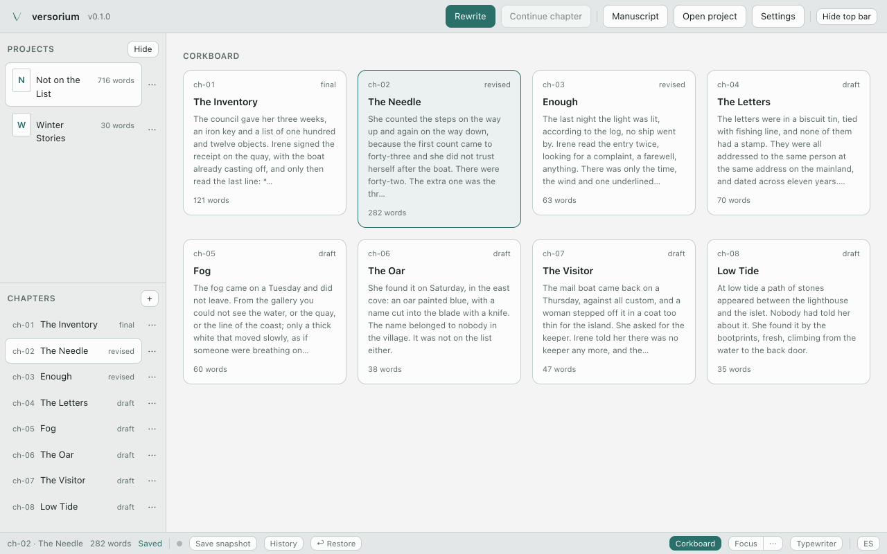
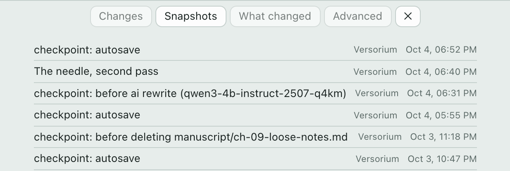
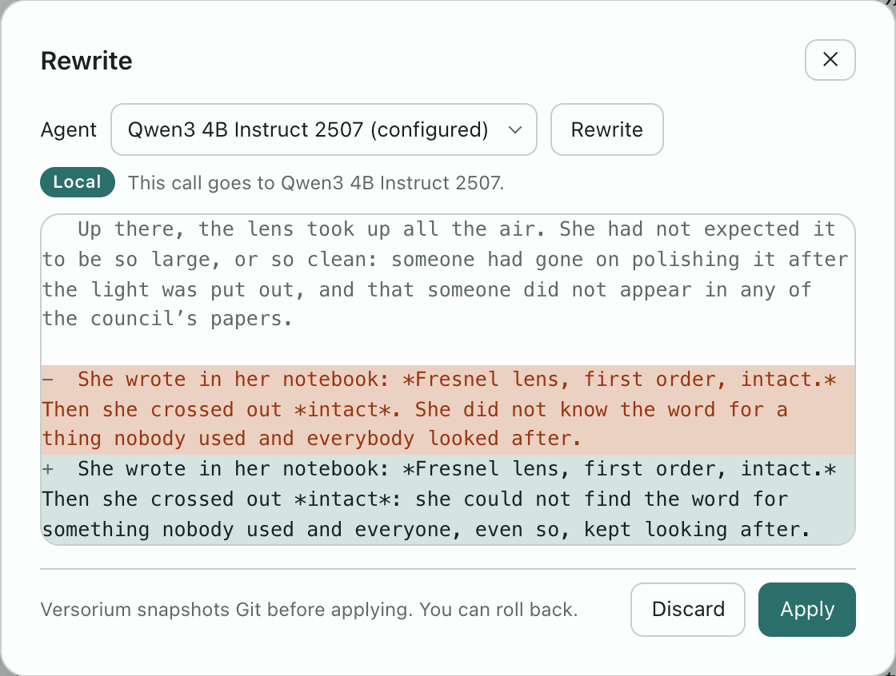

<p align="center">
  <a href="https://versorium.maecly.com/en/"></a>
</p>

<h1 align="center">Write your novel.<br>Every draft is <em>kept</em>.</h1>

<p align="center">
  <b>Versorium</b> is a novel-writing app for your own computer. It works offline.<br>
  AI stays off until you call it.
</p>

<p align="center">
  <b>Free</b> · <b>No account</b> · <b>Open source</b>
</p>

<p align="center">
  <a href="https://versorium.maecly.com/en/#download"></a>
</p>

<p align="center">
  <a href="https://versorium.maecly.com/en/#download"><sub>v0.1.1 · tried on Apple silicon Macs, Windows 11 and Ubuntu 22.04 (v0.1.0) · not yet on Intel Macs</sub></a>
</p>

<p align="center">
  <a href="https://github.com/MAECLY/versorium-app/releases/latest"></a>
  <a href="LICENSE"></a>
  <a href="#ready-to-download"></a>
  <a href="README.es.md"></a>
  <a href="https://versorium.maecly.com/en/details/#privacy"></a>
</p>

<p align="center">
  <a href="https://versorium.maecly.com/en/"><b>Website</b></a> ·
  <a href="#ready-to-download">Download</a> ·
  <a href="https://versorium.maecly.com/en/details/">Limits and details</a> ·
  <a href="CONTRIBUTING.md">Contributing</a> ·
  <a href="README.es.md">Español</a>
</p>

<p align="center">
  <a href="https://versorium.maecly.com/en/">
    <picture>
      <source media="(prefers-color-scheme: dark)" srcset=".github/readme/en/corkboard-dark.webp">
      
    </picture>
  </a>
</p>

> [!NOTE]
> **Early days, said plainly.** Versorium has been tried on an Apple silicon Mac, on Windows 11, and on Ubuntu 22.04 with v0.1.0's `.deb`. Intel Macs, the `.rpm` and the AppImage have not been run. If you run one, an [issue](https://github.com/MAECLY/versorium-app/issues) saying how it went helps a lot.

---

## I. Nothing gets lost.

Versorium saves as you type. Every minute when something changed, before an AI
writes anything and before a chapter is deleted, it takes a snapshot. Deleted a
sentence this session? **↩ Restore** brings it back.

Snapshots are Git commits, made with Git built into the app: you don't need to
install it, and you don't need to know it to write.

<p align="center">
  <picture>
    <source media="(prefers-color-scheme: dark)" srcset=".github/readme/en/history-dark.webp">
    
  </picture>
</p>

> [!NOTE]
> Going back to an old snapshot needs Git, for now. There is no screen for it in the app yet.

## II. Yours, start to finish.

- **A folder on your disk.** Every chapter is a plain Markdown file that opens
  without Versorium.
- **A record of who wrote what.** Every insert and delete is logged in the
  novel's folder with its author: you, or the AI that made it.
- **Backups you can trust.** One click writes a zip of the whole novel, history
  included, to up to three folders. Each zip is read back and checked after it
  is written, and a restore is unpacked beside your novel, never over it.
- **No account, no telemetry.** On its own, the app only checks for updates,
  with nothing from your novel, and you can turn that off.

If Versorium disappears tomorrow, your novel doesn't.

### AI, only if you call it.

It is off until you choose one, and it writes nothing without your permission.
Every rewrite shows the change first, and Versorium takes a snapshot before
applying it.

| Level | What runs | Where your passage goes |
|---|---|---|
| **Off** | Nothing | Nowhere |
| **On your computer** | A model run inside the app (built-in llama.cpp; 11 writing models to choose from, downloaded only when you ask), Ollama, or a local server such as LM Studio. | Stays on your computer. A local server you point at another machine is labelled Network. |
| **Your tool** | The Claude Code, Codex or OpenCode you already have installed and signed in. Rewrite only. | To that tool's own service |

Today the AI rewrites passages and, with a model on your computer, checks
continuity. Versorium is also an
[MCP server](#for-developers), so the assistants you already use can read your
manuscript. It is read-only unless you allow more.

<p align="center">
  <picture>
    <source media="(prefers-color-scheme: dark)" srcset=".github/readme/en/rewrite-dark.webp">
    
  </picture>
</p>

**Updates.** The app checks for them once at launch, with no account and nothing
from your novel; Settings → Application turns that off. An update installs only
if its minisign signature matches the key built into the app and its SHA-256
matches the release's `SHA256SUMS`. An update has been done end to end, from
0.1.0 to 0.1.1, on macOS (Apple silicon) and on Windows 11.

## III. A desk built for writing.

Corkboard · Focus · Rewrite · Typewriter · Spell check · Text size and width ·
Templates · One-click backup · English and Spanish

Three themes, Folio, Quarry and Needle, each light and dark. The pictures here
are Needle.

**Formats.** Export to manuscript-format DOCX, EPUB 3, PDF, Markdown and
Scrivener. Import from Markdown, DOCX, EPUB and Scrivener, with a preview before
anything is created.

## Ready to download.

[versorium.maecly.com](https://versorium.maecly.com/en/#download) picks the
right file for your computer. Or take it straight from the latest release:

| Computer | File | Tried |
|---|---|---|
| Mac with Apple silicon, macOS 10.15+ | [`.dmg`](https://github.com/MAECLY/versorium-app/releases/latest) | Yes |
| Mac with an Intel processor, macOS 10.15+ | [`.dmg`](https://github.com/MAECLY/versorium-app/releases/latest) | Not yet |
| Windows, x64 | [`.exe` installer or `.msi`](https://github.com/MAECLY/versorium-app/releases/latest) | Both (v0.1.0), on Windows 11, then the in-app update to 0.1.1 |
| Linux, x64 | [`.deb`, `.rpm` or `.AppImage`](https://github.com/MAECLY/versorium-app/releases/latest) | The `.deb` of v0.1.0, on Ubuntu 22.04. Not yet the `.rpm` or the `.AppImage` |

Each release lists a `SHA256SUMS` file. To hear about new releases: **Watch →
Custom → Releases** on this page, or the
[RSS feed](https://github.com/MAECLY/versorium-app/releases.atom).

> [!WARNING]
> The builds are not signed with an Apple or Microsoft certificate yet, so macOS
> and Windows warn you the first time. Only follow these steps for a file you
> took from this repository's releases.
>
> <details>
> <summary><b>macOS says the app is damaged.</b> It isn't.</summary>
>
> macOS quarantines apps without an Apple Developer ID. Move Versorium to
> Applications, then clear the flag once in Terminal:
>
> ```bash
> xattr -rd com.apple.quarantine /Applications/Versorium.app
> ```
>
> That flag is the check that protects you from a tampered download.
>
> </details>
>
> <details>
> <summary><b>Windows shows "Windows protected your PC".</b></summary>
>
> Choose **More info**, then **Run anyway**. Versorium needs an x86-64-v2
> processor (SSE4.2) and Vulkan (`vulkan-1.dll`, normally installed with the
> graphics drivers); a PC without Vulkan drivers hasn't been tried. If v0.1.0
> would not start because `MSVCP140.dll` was missing, v0.1.1 fixes that.
>
> </details>
>
> <details>
> <summary><b>Linux</b></summary>
>
> Mark the AppImage executable (`chmod +x`) if your file manager has not. The
> `.deb` depends on `libvulkan1` and `libssl3`. Versorium needs an x86-64-v2
> processor (SSE4.2).
>
> </details>

## What it doesn't do yet.

- The AI only rewrites passages and checks continuity. Continuity reads chapter
  titles, scene headings and the codex, not the prose, and only runs on a model
  on your computer. There is no chat, and "Continue chapter" is there but
  disabled.
- Spell check uses your system's checker: it works on macOS and Windows, and
  underlines nothing on Linux yet.
- Not run yet: Intel Macs, the `.rpm`, the AppImage, and v0.1.1 on Linux.
- Going back to a snapshot needs Git.
- Backups are made by hand.
- The builds are unsigned (see above).
- Importing from Word, EPUB or Scrivener loses bold, italics and scenes.

Every known limit, with what was and wasn't tried, is on the
[details page](https://versorium.maecly.com/en/details/#limits).

## Why it exists.

> I made Versorium for myself. I wanted to write calmly, never afraid of losing a page, with AI on my terms or not at all. The apps I tried fell short for novels or charged too much. So it's free and open source: your novel lives in a folder you own, every change is kept, and AI (the one you already pay for, one on your computer, or none) only steps in when you call it. I keep improving it.
>
> — Miguel Angel Esparza Calero, [maecly.com](https://www.maecly.com/about)

<details>
<summary><b>Questions</b></summary>

<br>

**Does my novel leave my computer?**
Only when you ask: sending it to GitHub, rewriting with an outside tool or a
server on another machine, letting an assistant read it over MCP, or backing it
up to a synced folder. On its own, the app only checks for updates,
with nothing from your novel, and you can turn that off.

**Do I need an account, or Git?**
No account: there's no sign-up. And you don't need Git to write: Versorium takes
the snapshots for you, with Git built in. For now, Git is only needed to go back
to an old snapshot.

**Which AI does it use?**
None until you choose one: a model inside the app itself, Ollama or a local
server, or Claude Code, Codex or OpenCode, which send the passage to their own
service.

**Does it work on Windows and Linux?**
It has been tried on Windows 11, and on Ubuntu 22.04 with v0.1.0's `.deb`. On
both it installed, created a novel and saved as you type, and on Windows an
update from 0.1.0 to 0.1.1 installed from inside the app. The `.rpm`, the
AppImage and v0.1.1 on Linux haven't been run yet.

**Can I bring my novel from Scrivener or Word?**
Yes: it imports Scrivener, DOCX, EPUB and Markdown, and shows you a preview
before creating anything. From DOCX, EPUB or Scrivener, bold, italics and scenes
are lost.

**Why is it free?**
It's open source (AGPL-3.0) and made by one person. There's no paid tier and no
ads, and the app collects no data.

</details>

## Help make it better.

You don't need to code to help.

- **Try it on an Intel Mac, or the `.rpm` or AppImage on Linux**, and
  [open an issue](https://github.com/MAECLY/versorium-app/issues) saying what
  happened.
- **Report a bug** from inside the app: the crash log's **Report** button opens
  a prefilled issue in your browser, with no novel text in it.
- **Improve the English or Spanish** in [`locales/`](locales).
- **Send a fix.** Read [CONTRIBUTING.md](CONTRIBUTING.md) and agree to the
  [Contributor License Agreement](CLA.md); you keep the copyright in what you
  write. Run the checks below before you open the pull request.

If Versorium is useful to you, a star helps other writers find it.

---

## For developers

Tauri 2 · Rust · Svelte 5 · CodeMirror 6 · libgit2 · llama.cpp

<details>
<summary><b>Build from source</b></summary>

<br>

You need stable Rust, Node `^20.19` or `>=22.12`, pnpm (pinned in
`package.json`), and cmake with a C/C++ toolchain, because llama.cpp is compiled
from source. Linux also needs the packages CI installs (listed in
[`ci.yml`](.github/workflows/ci.yml)).

```bash
pnpm install
make dev PNPM=pnpm             # the desktop app, with hot reload
make verify PNPM=pnpm          # every check: types, locales, UI, Rust, clippy, end-to-end
pnpm tauri build --no-sign     # installable bundles, without the maintainer's updater key
```

The Makefile expects a POSIX shell and defaults to Homebrew's pnpm on Apple
silicon, hence `PNPM=pnpm`. On Windows, run the scripts directly: `pnpm tauri dev`,
then `pnpm check`, `pnpm locales`, `pnpm test:ui`, `pnpm test:e2e` and
`cargo test` / `cargo clippy --all-targets -- -D warnings` in `src-tauri/`. The
end-to-end tests run in Google Chrome; set `PLAYWRIGHT_CHANNEL` to use another
Playwright browser. `make help` lists every target. `make mock` runs the interface in a browser with
the app's backend stubbed.

</details>

**MCP.** Versorium's own binary is an MCP server over stdio, **read-only by
default**. Settings → Access to your novel connects Claude Code, Claude Desktop,
Codex and OpenCode for you and shows the exact command. Writing needs a grant per
client; each write returns a diff preview first, needs `confirm: true`, and is
preceded by a Git snapshot. An optional HTTP transport is off by default and
listens on `127.0.0.1` only.

The full developer reference (the rules the project keeps, every build command,
agents, the MCP tools and hand-written client configs, and a novel's layout on
disk) is in [docs/project/REFERENCE.md](docs/project/REFERENCE.md). How the code
is laid out is in [AGENTS.md](AGENTS.md).

---

Versorium is free software under the [GNU Affero General Public License v3.0](LICENSE).
Contributions are accepted under the [CLA](CLA.md). The name, the wordmark and
the mark belong to MAECLY and are not covered by that licence; see
[TRADEMARKS.md](TRADEMARKS.md). Bundled third-party licences:
[THIRD-PARTY-NOTICES.md](THIRD-PARTY-NOTICES.md). For a commercial licence, write
to hola@maecly.com. Specs, status and how releases are made, for maintainers:
[docs/project/](docs/project/).

<p align="center">
  <sub><em>A quiet desk, a sharp needle.</em><br>
  Made by <a href="https://www.maecly.com/about">Miguel Angel Esparza Calero</a> · <a href="https://versorium.maecly.com/en/">versorium.maecly.com</a></sub>
</p>
